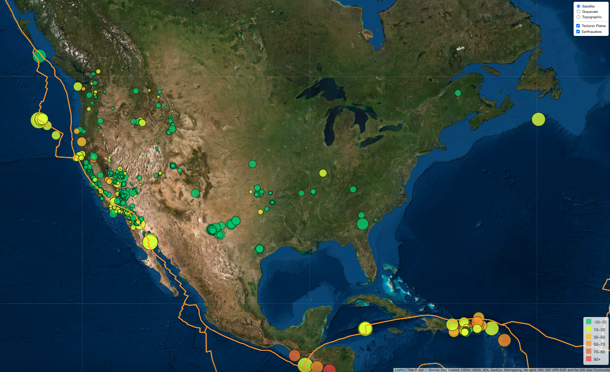

# Earthquake Visualization

Homework for Boot Camp Week 15: Leaflet and GeoJSON; Submitted by Corey Lawson-Enos

## Summary
* Web visualization that calls earthquake activity data for the past seven days, mapping epicenters with depth and magnitude indicators.
* Includes tectonic plate layer for immediate reference to proximity.

## Technologies
HTML, JavaScript, Leaflet, GeoJSON.

## Web Application Address

* https://clawson13.github.io/leaflet-challenge/

## Landing Preview

## Source

* USGS GeoJSON API: https://earthquake.usgs.gov/earthquakes/feed/v1.0/geojson.php
* Plate Tectonic GeoJSON data provided by Hugo Ahlenius, with Nordpil and Peter Bird as data source: https://github.com/fraxen/tectonicplates
